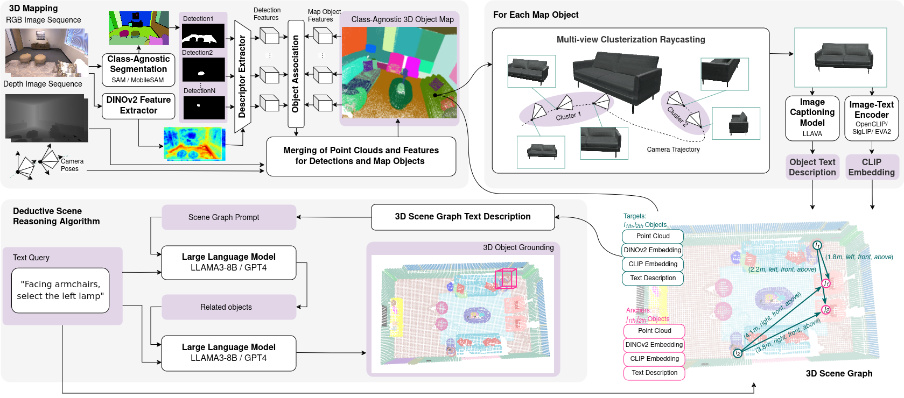

<p align="center">

  <h1 align="center">Beyond Bare Queries: <br>
Open-Vocabulary Object Grounding <br> with 3D Scene Graph</h1>
  <p align="center">
    <a href="https://github.com/linukc">Linok Sergey</a>
    ·
    <a href="https://github.com/wingrune">Tatiana Zemskova</a>
    ·
    Svetlana Ladanova
    ·
    Roman Titkov
    ·
    Dmitry Yudin
    <br>
    Maxim Monastyrny
    ·
    Aleksei Valenkov
  </p>

  <h4 align="center"><a href="https://linukc.github.io/BeyondBareQueries/">Project</a> | <a href="http://arxiv.org/abs/2406.07113">arXiv</a> | <a href="https://github.com/linukc/BeyondBareQueries">Code</a></h4>
  <div align="center"></div>
</p>

<p align="center">

</p>

## Getting Started

### System Requirements
10GB+ vRAM to run mapping and 16GB+ vRAM to run local LLM and vLLM.

### Data Preparation

#### Replica
Download the Replica RGB-D scan dataset using the downloading [script](https://github.com/cvg/nice-slam/blob/master/scripts/download_replica.sh) in Nice-SLAM. It contains rendered trajectories using the mesh models provided by the original Replica datasets.

#### ScanNet
For ScanNet, please follow the instructions in [ScanNet](https://github.com/ScanNet/ScanNet).

### Environment Setup
Build docker image and create container:

```bash
./docker/build.sh
./docker/start.sh <path_to_data_folder>
./docker/into.sh
```

Install **bbq** library, call this once for container:
```bash
pip install -e .
```

### Run BBQ

#### Mapping

First, build 3D scene representation. Check config before run. Inside container call script:

```python
python3 main.py --config_path=examples/configs/replica/room0.yaml #Replica
python3 main.py --config_path=examples/configs/scannet/scene0011_00.yaml #ScanNet
```

To visualize construction process:
```python
python3 main.py --config_path=examples/configs/replica/room0.yaml --save_path=output
python3 visualize/show_construction.py --animation_folder=output
```

#### Object Grounding

##### Llama3-8B

Setup Meta-Llama-3-8B-Instruct according to the [docs](https://huggingface.co/meta-llama/Meta-Llama-3-8B-Instruct).

```python
# Llama3-8B
python3 query.py --scene_file=examples/scenes/replica/room0.json --model_path=<your_path>/Meta-Llama-3-8B-Instruct #Replica
python3 query.py --scene_file=examples/scenes/scannet/scene0011_00.json --model_path=<your_path>/Meta-Llama-3-8B-Instruct #ScanNet
```

## Acknowledgement
We base our work on the following paper codebase: [ConceptGraphs](https://github.com/concept-graphs/concept-graphs).

## Citation
If you find this work helpful, please consider citing our work as:
```
@misc{linok2024barequeriesopenvocabularyobject,
      title={Beyond Bare Queries: Open-Vocabulary Object Grounding with 3D Scene Graph}, 
      author={Sergey Linok and Tatiana Zemskova and Svetlana Ladanova and Roman Titkov and Dmitry Yudin and Maxim Monastyrny and Aleksei Valenkov},
      year={2024},
      eprint={2406.07113},
      archivePrefix={arXiv},
      primaryClass={cs.CV},
      url={https://arxiv.org/abs/2406.07113}, 
}
```

## Contact
Please create an issue on this repository for questions, comments and reporting bugs. Send an email to [Linok Sergey](linok.sa@phystech.edu) for other inquiries.
